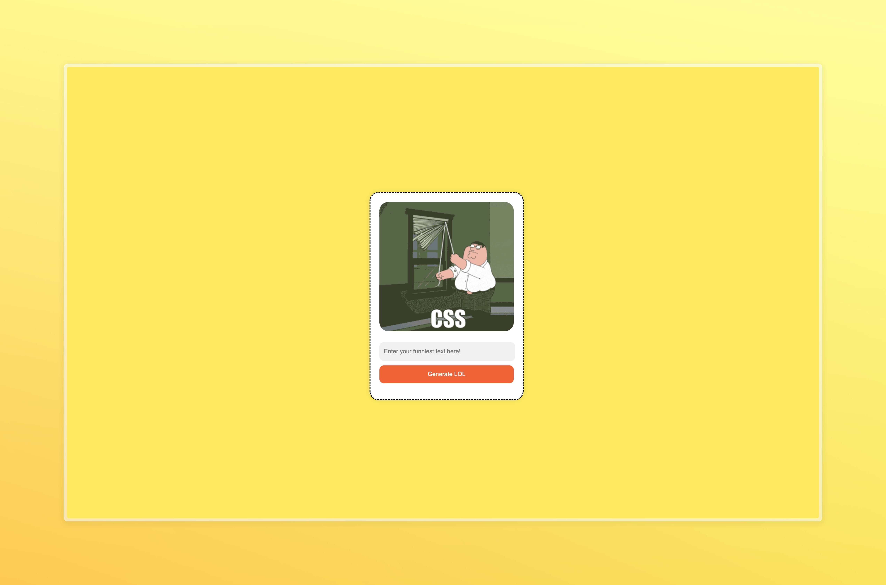

# 🤣 Meme Blast  

**Meme Blast** is a fun and interactive web app that fetches memes based on user input using the **Tenor API**. Just type in a keyword, and get instant meme results!  

---

## 📑 Table of Contents  

1. [Overview](#-overview)  
2. [Technologies](#-technologies)  
3. [Packages & Libraries Used](#-packages--libraries-used)  
4. [Getting Started](#-getting-started)  
5. [Setup](#-setup)  
6. [Features](#-features)  
7. [Demo & Screenshots](#-demo--screenshots)  
8. [Acknowledgments](#-acknowledgments)  
9. [License](#-license)  

---

## 🌟 Overview  

**Meme Blast** is a simple web application that allows users to generate memes dynamically based on their input using the **Tenor API**.  

---

## 💻 Technologies  

This project is built with:  

| Technology | Description |  
|------------|-------------|  
| **HTML**  | Structure of the web page |  
| **CSS**   | Styling for an appealing UI |  
| **JavaScript** | Handles API requests and user interactions |  
| **Tenor API** | Fetches memes dynamically based on user input |  

---

## 📦 Packages / Libraries Used  

None (Vanilla JS used).  

---

## 🚀 Getting Started  

1. Download any IDE like Visual Studio Code.
---

## ⚙️ Setup  

1. Clone the repositry :
    ```bash
    git clone https://Github.com/Jenil-Desai/meme-blast
    ```

2. Go To Project Folder :
    ```bash
    cd meme-blast
    ```

3. Run the local server using vscode extensions.

---

## 🎯 Features  

1. **Search for memes** based on user input.  
2. **Fetches memes dynamically** using the Tenor API.  

---

## 🔗 Demo & Screenshots  



---

## 🙏 Acknowledgments  

1. [Tenor API Docs](https://developers.google.com/tenor)  

---

## 📜 License  

This project is licensed under the [MIT License](LICENSE). See the [LICENSE](LICENSE) file for details.  

---

### 🎉 **Blast your screen with memes using Meme Blast!**
